# Shiva Frontend
[](https://deepwiki.com/AutschPotato/shiva-frontend)

Distributed load testing dashboard built with:

- Next.js 16 (App Router)
- React 19
- TailwindCSS 4
- Recharts (data visualization)
- TypeScript

Runtime requirements:

- Node.js 24.x (see `package.json` engines)
- pnpm 9.x

## License and Legal Notice

This repository is proprietary and is not released under an open source license.

- Copyright (c) 2026 AutschPotato. All rights reserved.
- No permission is granted to use, copy, modify, merge, publish, distribute, sublicense, sell, or create derivative works from this source code without prior written permission from the copyright holder.
- Access to the repository, source visibility, or the ability to open pull requests does not grant any separate license or usage right.

See [LICENSE.md](./LICENSE.md) for the repository-wide notice.

## Quick Start For Windows

Prerequisites:

- Docker Desktop
- A running Shiva Platform backend on `http://localhost:8080`

From the repo root in PowerShell:

```powershell
docker compose -f .\docker-compose.frontend.yml up -d --build
```

Open:

- Frontend: `http://localhost:3001`

Default local login:

- `admin / changeme`

Stop the frontend again:

```powershell
docker compose -f .\docker-compose.frontend.yml down
```

If the backend is not reachable on `http://localhost:8080`, adjust `CONTROLLER_URL` in [docker-compose.frontend.yml](./docker-compose.frontend.yml) or create a local `.env` from [.env.example](./.env.example).

## Package Manager Policy

- The canonical package manager for this frontend is `pnpm`.
- `pnpm-lock.yaml` is the intended source of truth.
- `package-lock.json` should not exist in this repo and should not be recreated.

## Authentication

- The Next.js app requires authentication before accessing dashboards or running tests. Use `/login` to authenticate with username/email + password.
- On a fresh install, backend bootstraps an admin account from `INITIAL_ADMIN_*` environment variables.
- Administrators get a dedicated `Users` menu where they can list existing accounts and create new admin/user credentials.
- All users get a `Profile` page to update their password; load test results record the `run_by` identity for auditing.
- Proxy (`/api/backend`) forwards the JWT and backend API key automatically after you log in.
- The frontend is intentionally deployable separately from the controller as long as `CONTROLLER_URL` points to a reachable backend deployment.

## Environment Variables

Create `.env`:

```
CONTROLLER_URL=http://controller:8080
CONTROLLER_API_KEY=your_controller_api_key_here
```

These values are read server-side by `app/api/backend/[...path]/route.ts` and are not exposed to the browser.

Use [.env.example](./.env.example) as the baseline.

The split-critical contract is documented in:

- [docs/controller-integration.md](./docs/controller-integration.md)

## Development

Install dependencies:

```
pnpm install
```

Run dev server:

```
pnpm dev
```

Build production bundle:

```
pnpm build
```

Server runs on `http://localhost:3000`.

## Playwright

Playwright ownership now lives with the frontend package.

Install and run:

```
pnpm playwright:install
pnpm validate:separate-deployment
pnpm validate:separate-deployment:writes
pnpm test:e2e
pnpm test:e2e:headed
pnpm test:e2e:ui
pnpm codegen:e2e
```

Files:

- config: [playwright.config.cjs](./playwright.config.cjs)
- tests: [tests/e2e](./tests/e2e)
- artifacts: [artifacts](./artifacts)

## Working Model

- This repository is the frontend single source of truth for ongoing development.
- Do not continue feature work in the legacy monorepo or in any exported staging directory.
- Use short-lived feature branches such as `feature/...`, `bugfix/...`, or `chore/...`; keep `main` releasable.
## CI / Ownership

This frontend side owns:

- Next.js build automation
- Playwright discovery and E2E automation
- frontend deployment automation
- frontend-side docs and environment-contract maintenance

The prepared CI workflow for the future frontend repo is:

- [.github/workflows/frontend-ci.yml](./.github/workflows/frontend-ci.yml)

## Docker

Fast local start:

```powershell
docker compose -f .\docker-compose.frontend.yml up -d --build
```

Manual image build:

```
docker build -t shiva-frontend .
```

The Docker build intentionally uses `pnpm` and `pnpm-lock.yaml` as the single dependency source of truth.

Run:

```
docker run -p 3000:3000 \
  -e CONTROLLER_URL=http://controller:8080 \
  -e CONTROLLER_API_KEY= \
  shiva-frontend
```

The container expects controller-related configuration at runtime. The image no longer relies on copying a local `.env` file into the image.

For separate-deployment validation, see:

- [docs/separate-deployment-validation.md](./docs/separate-deployment-validation.md)

For a quick smoke check against a separately deployed frontend/backend pair, run:

```
pnpm validate:separate-deployment
```

For the heavier split validation that also covers real builder/template/schedule writes, run:

```
pnpm validate:separate-deployment:writes
```

## Features

### Builder Mode
- Dynamic stages configuration
- Real-time progress via SSE streaming
- Animated progress bar
- Success & error notifications
- Auto redirect to result page

### Dashboard
- Performance trend line (animated)
- Error rate trend
- Score breakdown donut chart
- Animated KPI counters
- Worker status overview
- Recent activity feed

### Result Table
- Filter by ID or Project Name
- Pagination
- Mobile responsive card view
- Grade badges

### Result Detail
- Performance metrics table (avg, p95, p99, total requests, error rate)
- Latency trend chart
- Throughput chart

## Web UI Tour

The screenshot set below documents every user-facing route in the current frontend App Router.

- Screenshots are generated from a local Docker deployment against the active split repositories.
- Use `admin / changeme` for the default local login.
- Refresh the image set with `pnpm docs:screenshots` after starting the platform on `http://localhost:8080` and the frontend on `http://localhost:3001`.
- The reset password screenshot uses a demo token in the URL, and the worker dashboard screenshots use stable sample dashboard metadata so the documentation does not depend on a live worker-side dashboard session.

<details>
<summary>Public routes</summary>

### Login
The sign-in page is the entry point for administrators and maintainers.

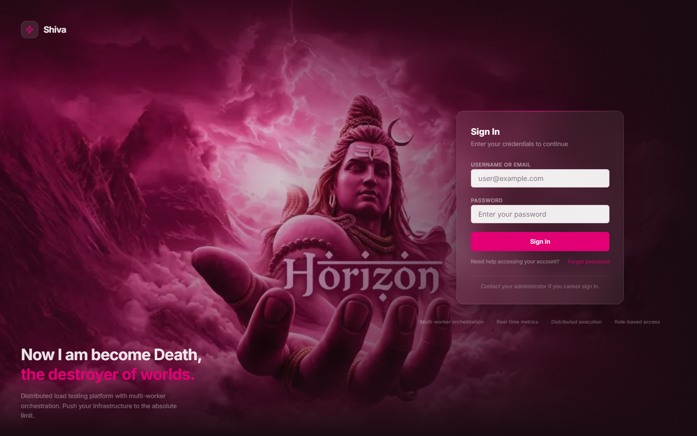

### Forgot Password
The recovery flow lets a user request a reset link by username or email.

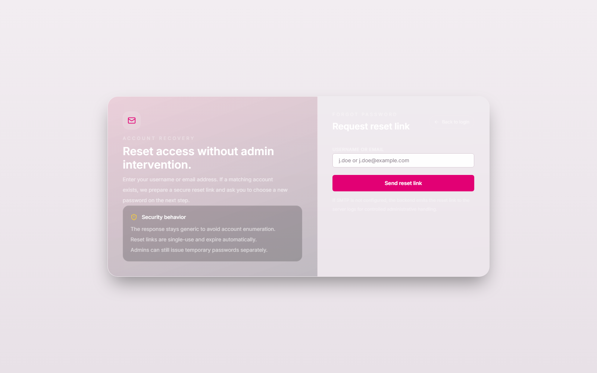

### Reset Password
The reset form consumes the single-use token and lets the user choose a new password.

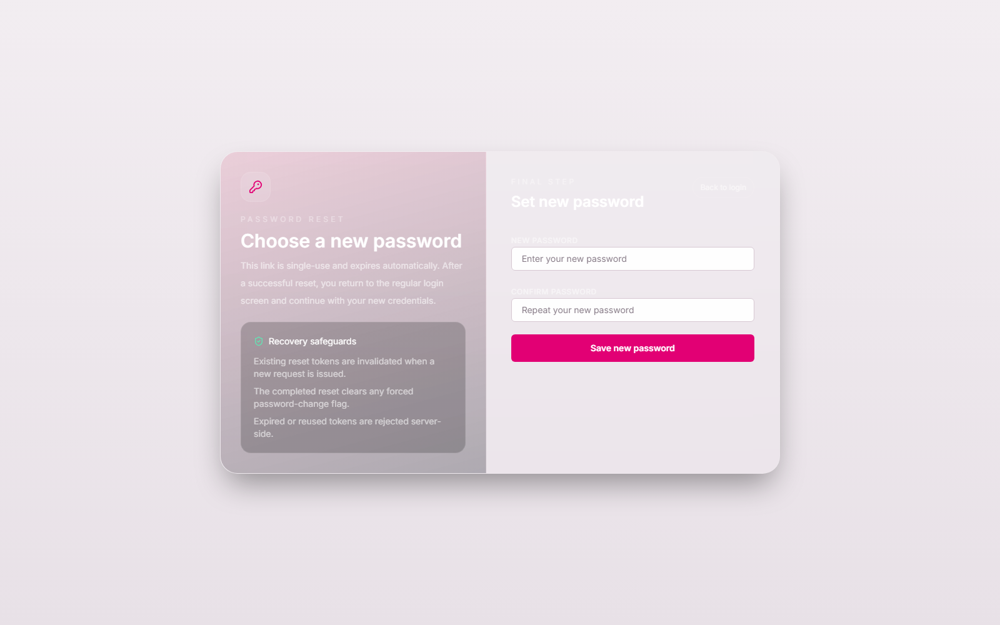

</details>

<details>
<summary>Authenticated workspace</summary>

### Overview
The landing dashboard summarizes controller status, worker availability, recent runs, and endpoint inventory.

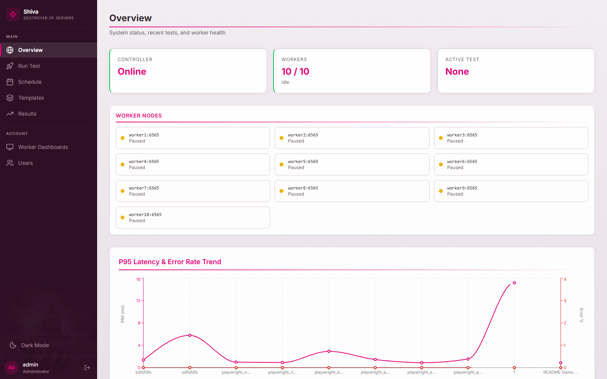

### Run Test
The load test builder configures the target, execution model, payload, and runtime options for a new run.

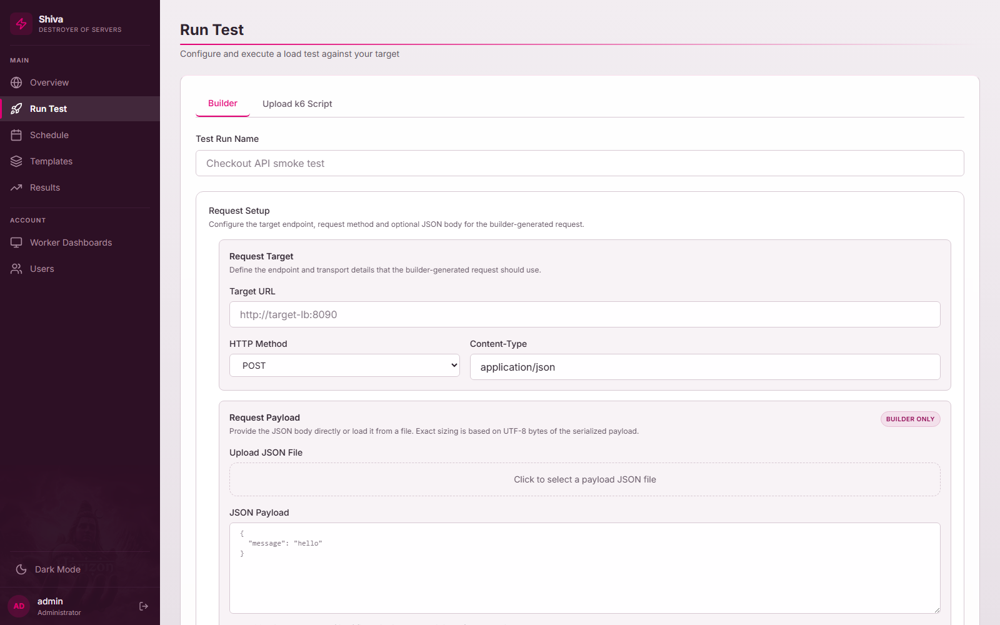

### Schedules
The schedule workspace combines search, calendar visibility, and lifecycle controls for planned executions.

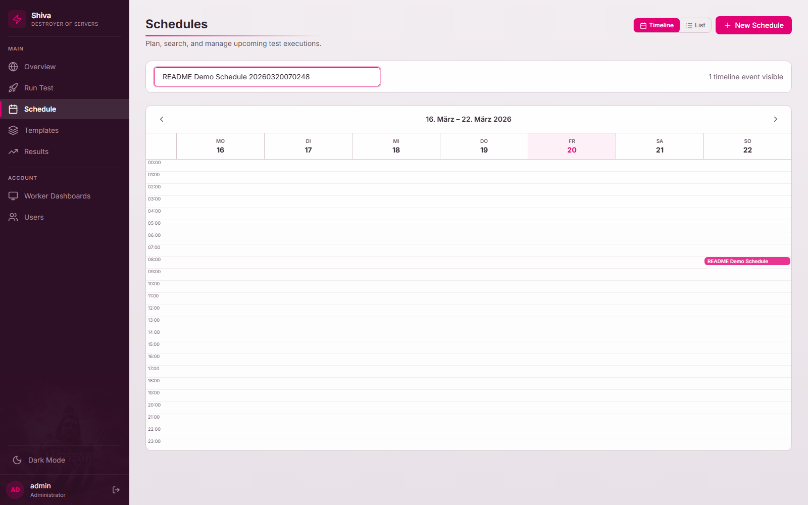

### New Schedule
The schedule creation form supports recurrence planning, builder settings, and loading from saved templates.

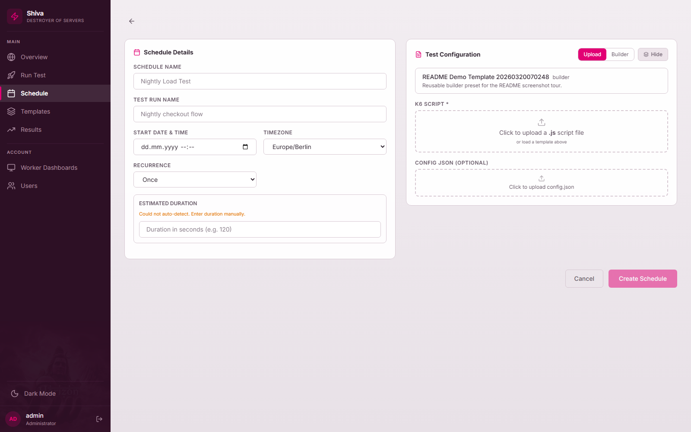

### Schedule Detail
The detail view shows the selected occurrence, recurrence metadata, execution history, and management actions.

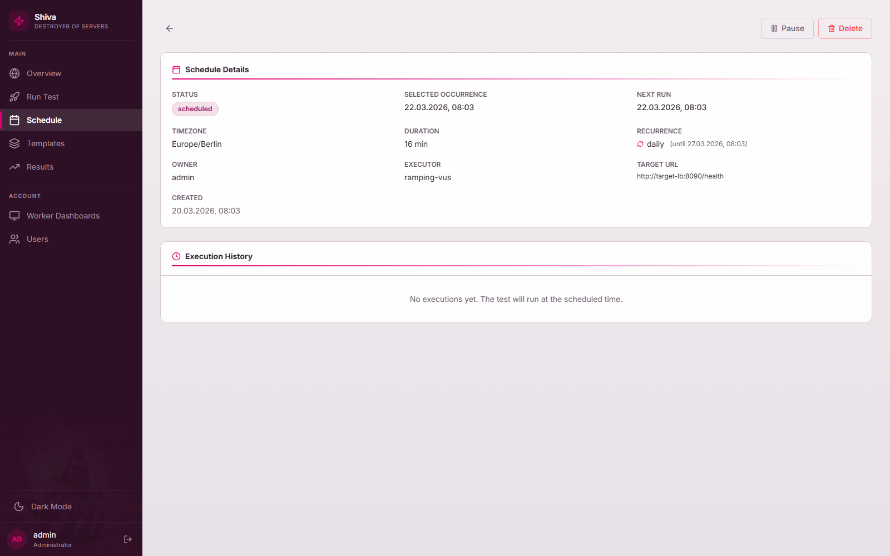

### Templates
The templates workspace curates reusable builder presets and administrative system-template actions.

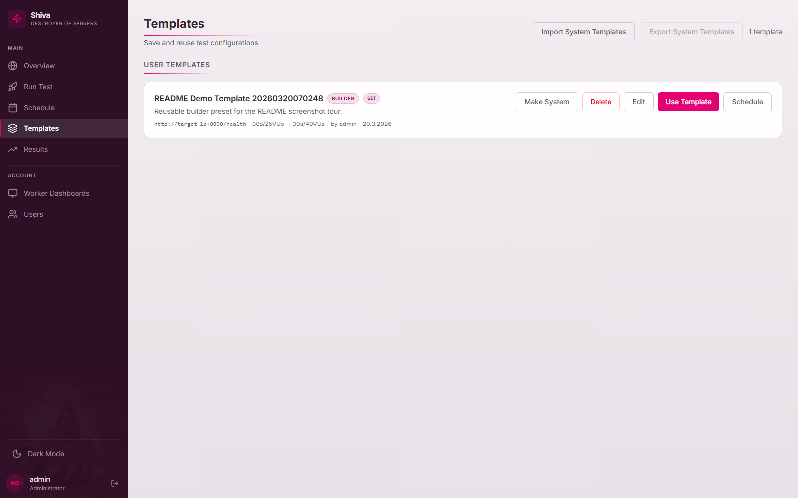

### Results
The results index supports searching, paging, and quick access to completed runs.

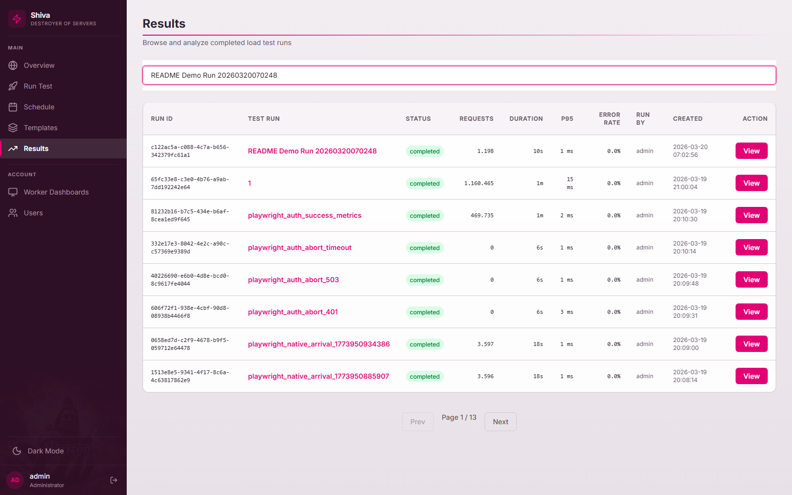

### Result Detail
The result detail page exposes executive metrics, charts, warnings, and rerun or template actions.

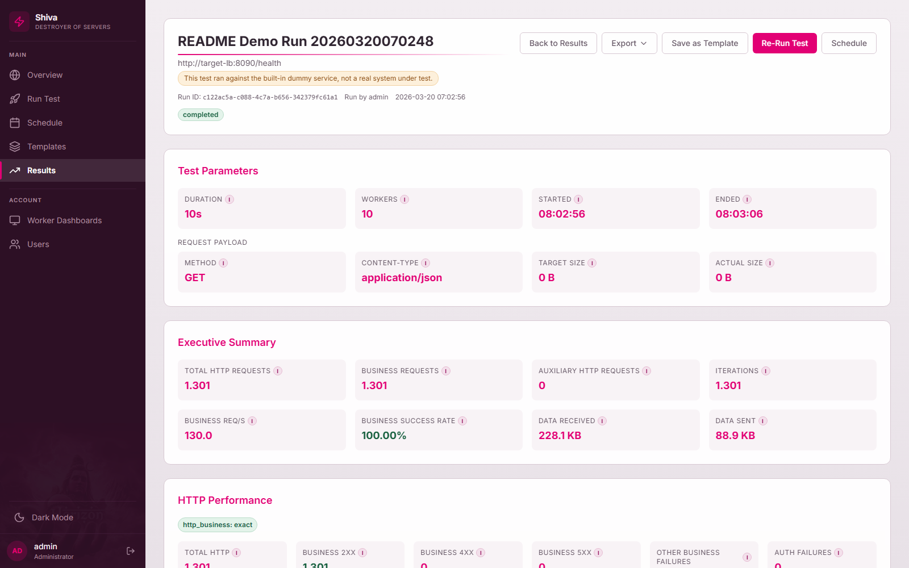

### Worker Dashboards
The worker dashboard launcher gives administrators access to per-worker live k6 dashboards.

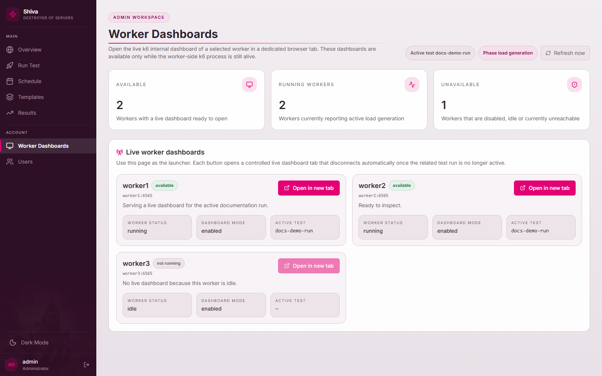

### Worker Dashboard Detail
The live worker wrapper keeps the embedded dashboard isolated behind the authenticated frontend shell.

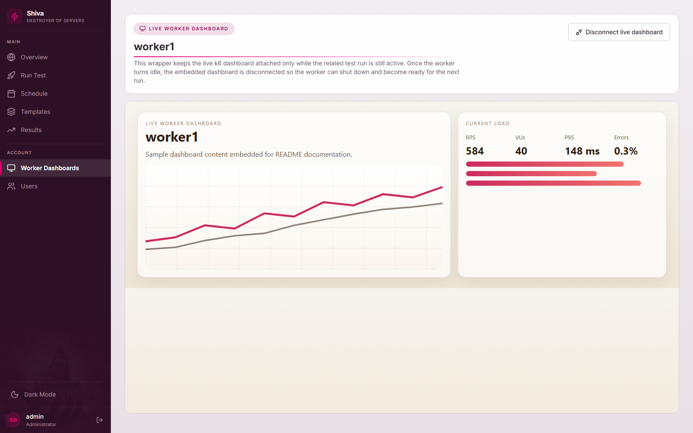

### Users
The admin-only users page combines account creation, user search, activity metrics, and password reset actions.

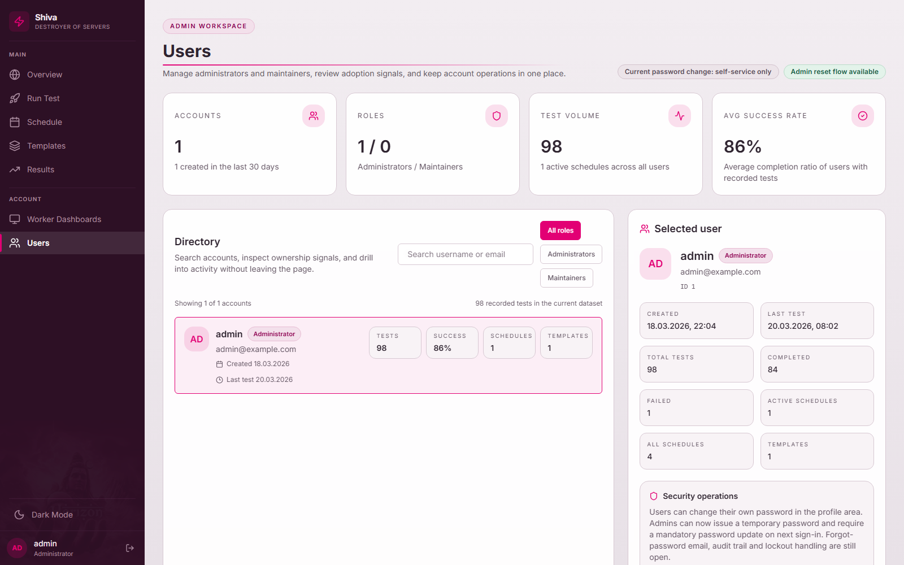

### Profile
The profile page shows personal activity metrics and the password/security controls for the signed-in user.

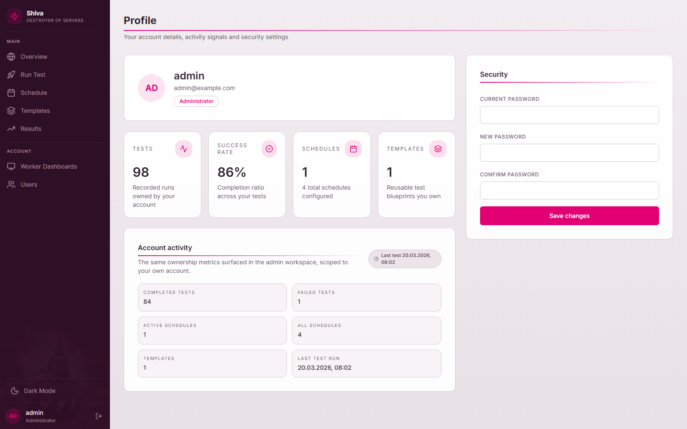

</details>

## Data Flow

Frontend -> Go Backend `POST /api/run` (distributed to k6 workers)

Backend streams SSE logs -> frontend updates progress UI

When finished, auto redirects to `/result/{id}`.

## API Endpoints

- `POST /api/run` - Start distributed load test
- `POST /api/stop` - Stop running test
- `GET /api/metrics/live` - Live aggregated metrics
- `GET /api/workers/status` - Worker status
- `GET /api/result/list` - Results list
- `GET /api/result/{id}` - Single result
- `POST /api/auth/login` - Login
- `GET /api/auth/users` - List users (admin)
- `POST /api/auth/users` - Create user (admin)
- `PUT /api/profile/password` - Update password
- `POST /api/resetdata` - Reset data
- `GET /api/health` - Health check

## Split Ownership

This frontend is intended to be the future `shiva-frontend` repository.

It owns:

- Next.js application code
- frontend-side docs
- Next proxy/BFF route under `app/api/backend`
- Playwright E2E and codegen setup
- frontend-local build and artifact configuration

